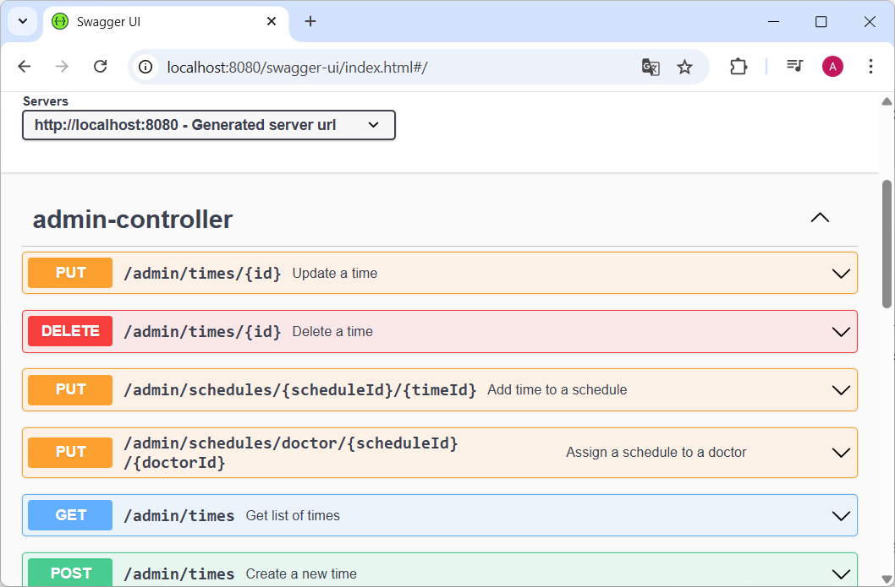
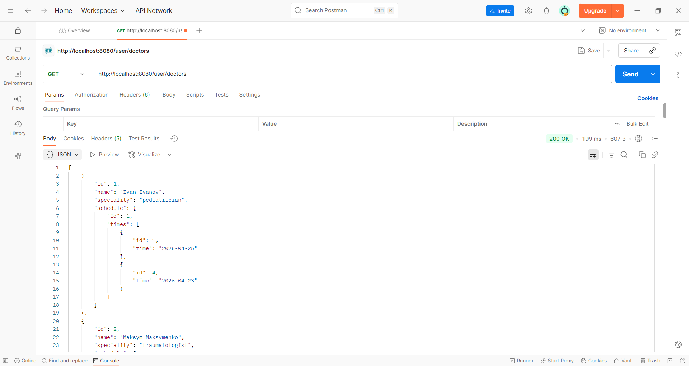
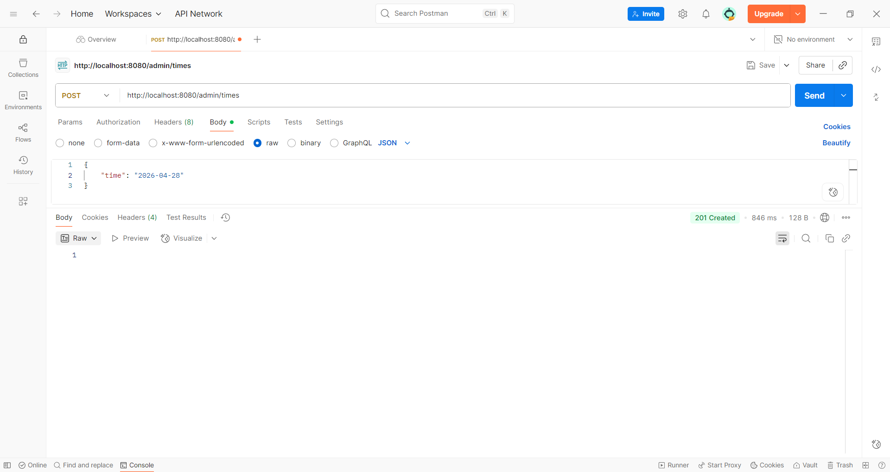
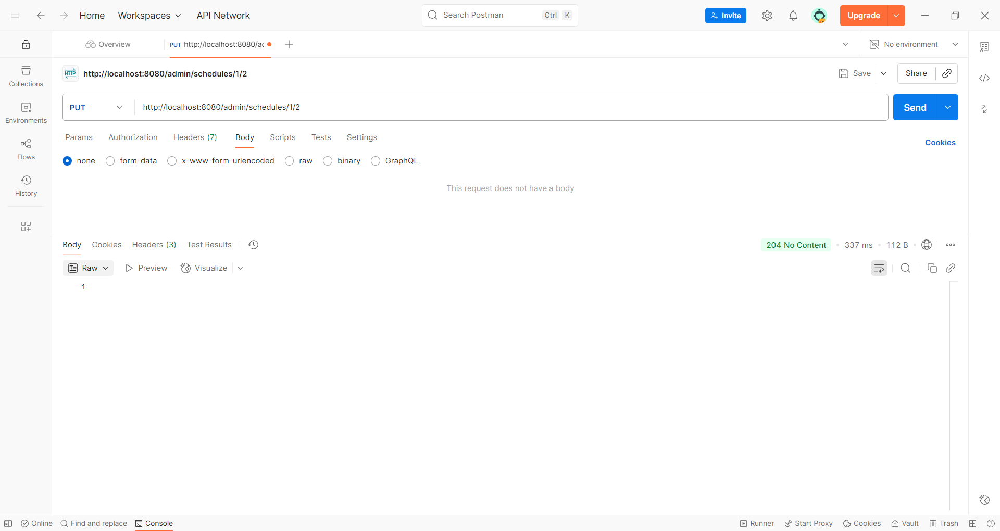
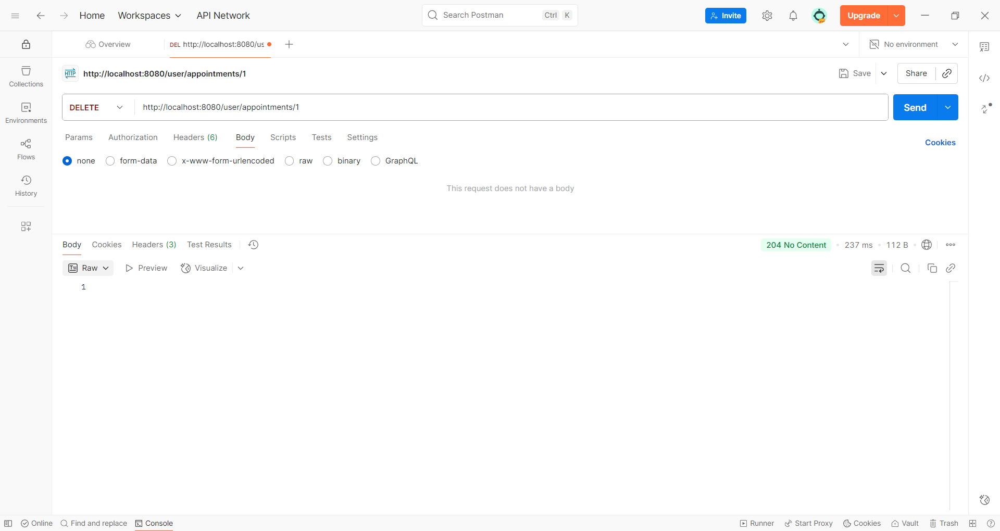

# Реєстратура поліклініки  
Бекенд-застосунок, призначений для автоматизації роботи медичного закладу. Дозволяє координувати взаємодію між адміністраторами, лікарями та пацієнтами через централізовану систему управління розкладом.  
## Основні можливості  
1. Для адміністраторів CRUD операції (створення, перегляд, оновлення, видалення) для:
* Керування часом прийому
* Керування розкладом лікарів
2. Для користувачів:
* Перегляд розкладу лікарів
* Створення запису на прийом до лікаря та видалення запису
## Стек технологій
* **Мова:** Java
* **Фреймворк:** Spring Boot
* **Доступ до даних:** Spring Data JPA, Hibernate 
* **База даних:** MySQL
* **Документація:** Swagger
* **Інструменти:** Maven, Docker
## Як запустити проєкт  
1. Клонуйте репозиторій  
`git clone ...`
2. Налаштуйте БД  
Запустіть Docker  
`docker-compose up -d`
3. Запустіть застосунок  
`mvn spring-boot:run`
4. Перегляд документації  
Перейдіть за посиланням `http://localhost:8080/swagger-ui/index.html#/`  
  
## Приклади запитів  
  
| Метод  | Ендпоінт                                                    | Опис                     | Результат                                |
|--------|-------------------------------------------------------------|--------------------------|------------------------------------------|
| GET    | http://localhost:8080/user/doctors                          | Отримати список лікарів  |        |
| POST   | http://localhost:8080/admin/times                           | Створити новий час       |      |
| PUT    | http://localhost:8080/admin/schedules/{scheduleId}/{timeId} | Додати час у розклад     |        |
| DELETE | http://localhost:8080/user/appointments/{id}                | Видалити запис на прийом |  |
